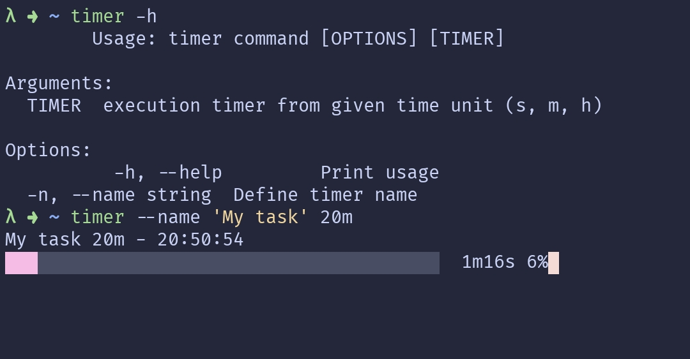

# ⏱️ timer-cli

The timer-cli gem is a simple command line interface that allows you to set a timer for a specified amount of time.



## Installation

```ruby
gem install timer-cli
```

## Usage

To start the timer, run the following command:

```bash
timer --name "My Timer" 25m
```

## Contributing

Bug reports and pull requests are welcome on GitHub at https://github.com/dvinciguerra/timer-cli. This project is intended to be a safe, welcoming space for collaboration, and contributors are expected to adhere to the [code of conduct](https://github.com/dvinciguerra/timer-cli/blob/main/CODE_OF_CONDUCT.md).

## License

The gem is available as open source under the terms of the [MIT License](https://opensource.org/licenses/MIT).

## Code of Conduct

Everyone interacting in the `timer-cli` project's codebases, issue trackers, chat rooms and mailing lists is expected to follow the [code of conduct](https://github.com/dvinciguerra/timer-cli/blob/main/CODE_OF_CONDUCT.md).
